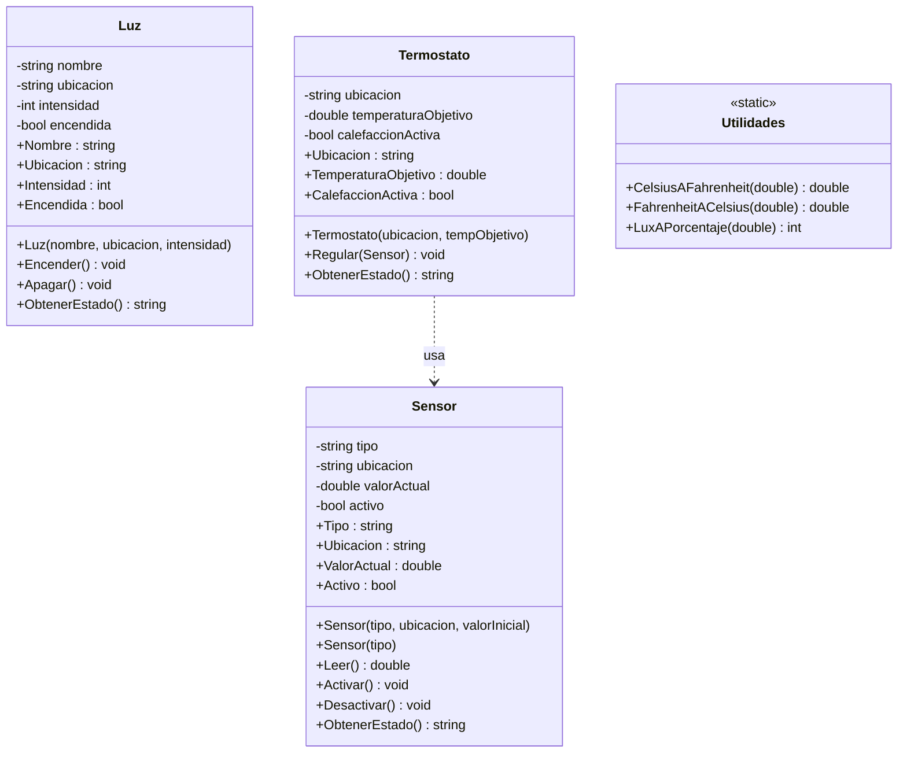
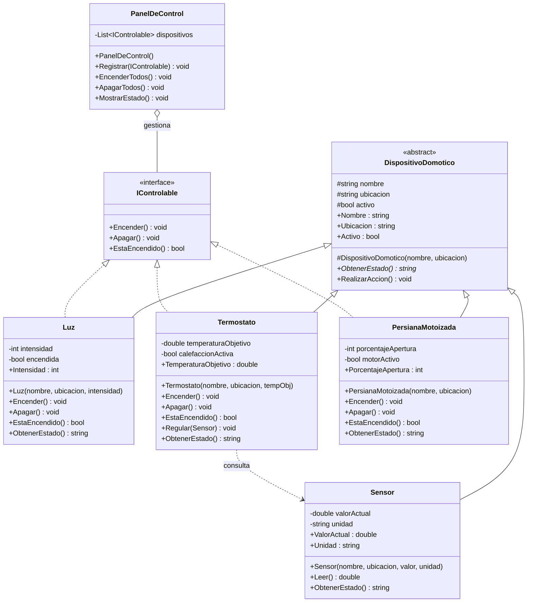

# Casa Inteligente — Soluciones de referencia

Repositorio con las soluciones de referencia del proyecto **Casa Inteligente** (DomòticaMallorca S.L.), desarrollado como hilo conductor del módulo **Programación (0485)** del 1.er curso del CFGS en Desarrollo de Aplicaciones Multiplataforma.

> **Uso interno del docente.** Este código no se comparte con el alumnado antes de las actividades; su finalidad es la corrección y la evaluación.

---

## Estructura del repositorio

```
casa-inteligente/
├── ud3-sprint1/            ← UD 3: Fundamentos de POO
│   └── CasaInteligente/
│       ├── Sensor.cs
│       ├── Luz.cs
│       ├── Termostato.cs
│       ├── Utilidades.cs
│       └── Program.cs
├── ud4-code-review/        ← UD 4: POO Avanzada y Refactorización
│   └── CasaInteligente/
│       ├── IControlable.cs
│       ├── DispositivoDomotico.cs
│       ├── Sensor.cs
│       ├── Luz.cs
│       ├── Termostato.cs
│       ├── PersianaMotoizada.cs
│       ├── PanelDeControl.cs
│       └── Program.cs
└── docs/
    ├── uml-ud3.md
    └── uml-ud4.md
```

---

## Diagrama UML — UD 3: El Prototipo Rígido

Arquitectura plana sin herencia. Cada clase es independiente; la interacción se produce cuando `Termostato` recibe un objeto `Sensor` en su método `Regular()`.



---

## Diagrama UML — UD 4: La Evolución Flexible

Arquitectura refactorizada con herencia, clase abstracta, interfaz y polimorfismo. `Sensor` hereda pero no implementa `IControlable` (decisión de diseño coherente: un sensor no se "enciende"). `PanelDeControl` opera polimórficamente sobre cualquier `IControlable`.



---

## Salida esperada por consola

### UD 3

```
=== ESTADO DEL SISTEMA ===
[Temperatura] Salón: 23 (ACTIVO)
[Temperatura] Dormitorio: 21 (ACTIVO)
[Humedad] Jardín: 65 (ACTIVO)
[Movimiento] Sin asignar: 0 (ACTIVO)
[Luz] Principal (Salón): ENCENDIDA al 80%
[Luz] Exterior (Jardín): ENCENDIDA al 50%
[Termostato] Salón: Objetivo 22 C (EN ESPERA)
Temperatura salón: 73,4 F
```

### UD 4

```
=== ENCENDIENDO TODOS LOS DISPOSITIVOS ===
[Luz] Principal (Salón): ENCENDIDA al 80%
[Luz] Exterior (Jardín): ENCENDIDA al 50%
[Termostato] Calefacción (Salón): Obj. 22 C (CALENTANDO)
[Persiana] Veneciana (Salón): 100% abierta

=== REGULANDO TERMOSTATO ===
[Termostato] Calefacción (Salón): Obj. 22 C (CALENTANDO)

=== ESTADO DE SENSORES ===
[Sensor] Temp. Salón (Salón): 19,5 °C
[Sensor] Humedad (Jardín): 65 %

=== APAGANDO TODO ===
[Luz] Principal (Salón): APAGADA
[Luz] Exterior (Jardín): APAGADA
[Termostato] Calefacción (Salón): Obj. 22 C (EN ESPERA)
[Persiana] Veneciana (Salón): 0% abierta
```

---

## Evolución entre UD 3 y UD 4

| Aspecto | UD 3 (Prototipo Rígido) | UD 4 (Evolución Flexible) |
|---|---|---|
| Herencia | No hay. Clases independientes. | `DispositivoDomotico` como superclase abstracta. |
| Interfaces | No hay. | `IControlable` define el contrato de actuadores. |
| Polimorfismo | No hay. Cada objeto se gestiona individualmente. | `PanelDeControl` opera sobre `List<IControlable>`. |
| Extensibilidad | Añadir un dispositivo obliga a modificar `Program`. | `PersianaMotoizada` se añade sin tocar código existente. |
| Control de versiones | Google Workspace. | GitHub con flujo GitHub Flow (ramas, PR, Code Review). |

---

## Tecnologías

- **Lenguaje:** C# (.NET)
- **IDE:** Visual Studio / Visual Studio Code
- **Modelado UML:** Draw.io / Mermaid
- **Control de versiones:** Git + GitHub

---

## Licencia

Material didáctico de uso interno. CIFP Francesc de Borja Moll, Palma de Mallorca.

---

Autor: [Noel Sansó](https://github.com/noelsansobarcelo)
