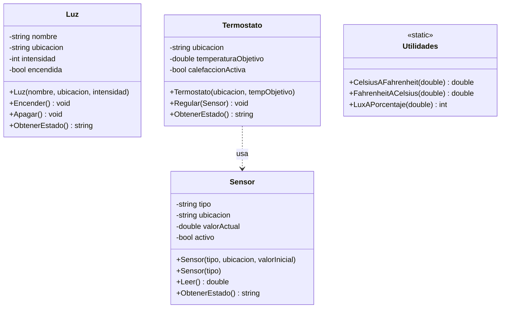

# Diagrama UML — UD 3: Fundamentos de POO

Arquitectura plana sin herencia. Cada clase es independiente.

```mermaid
classDiagram
    class Sensor {
        -string tipo
        -string ubicacion
        -double valorActual
        -bool activo
        +Sensor(tipo, ubicacion, valorInicial)
        +Sensor(tipo)
        +Leer() double
        +ObtenerEstado() string
    }

    class Luz {
        -string nombre
        -string ubicacion
        -int intensidad
        -bool encendida
        +Luz(nombre, ubicacion, intensidad)
        +Encender() void
        +Apagar() void
        +ObtenerEstado() string
    }

    class Termostato {
        -string ubicacion
        -double temperaturaObjetivo
        -bool calefaccionActiva
        +Termostato(ubicacion, tempObjetivo)
        +Regular(Sensor) void
        +ObtenerEstado() string
    }

    class Utilidades {
        <<static>>
        +CelsiusAFahrenheit(double) double
        +FahrenheitACelsius(double) double
        +LuxAPorcentaje(double) int
    }

    Termostato ..> Sensor : usa
```
