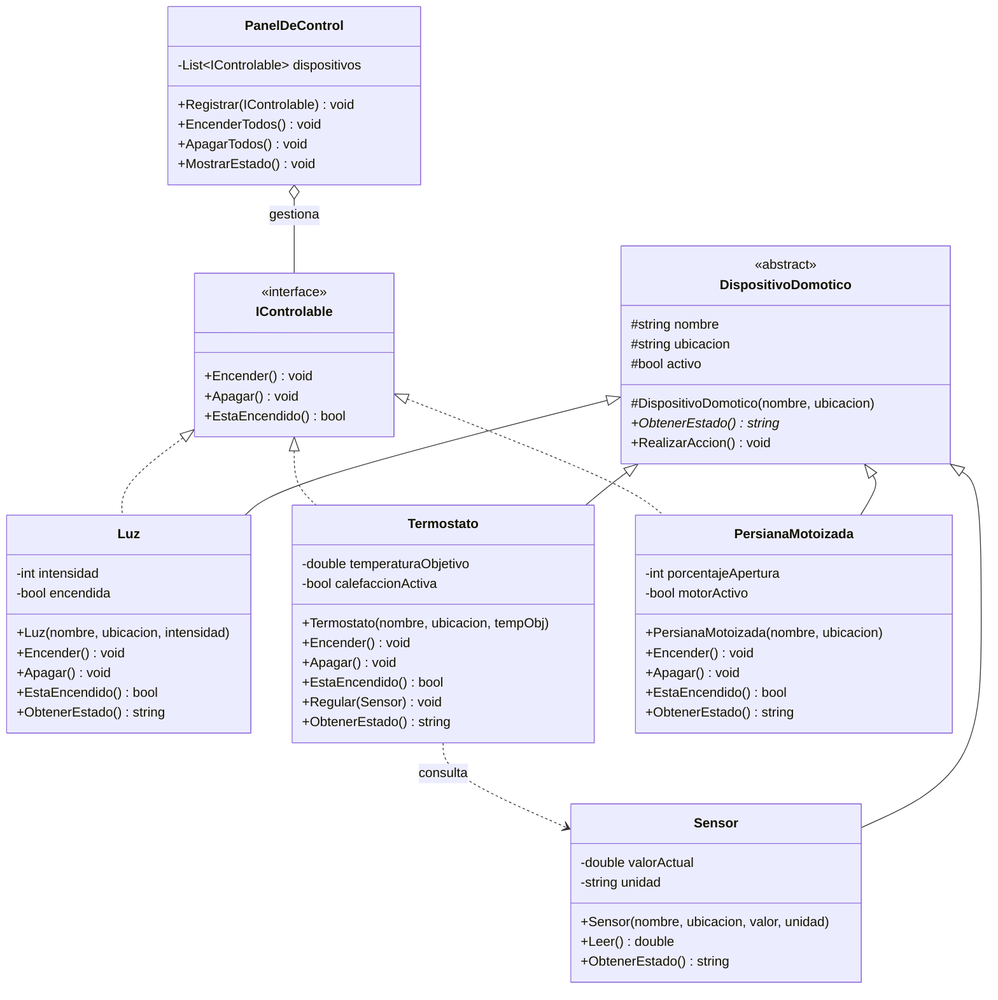

# Diagrama UML — UD 4: POO Avanzada y Refactorización

Arquitectura refactorizada con herencia, clase abstracta, interfaz y polimorfismo.

```mermaid
classDiagram
    class IControlable {
        <<interface>>
        +Encender() void
        +Apagar() void
        +EstaEncendido() bool
    }

    class DispositivoDomotico {
        <<abstract>>
        #string nombre
        #string ubicacion
        #bool activo
        #DispositivoDomotico(nombre, ubicacion)
        +ObtenerEstado() string*
        +RealizarAccion() void
    }

    class Sensor {
        -double valorActual
        -string unidad
        +Sensor(nombre, ubicacion, valor, unidad)
        +Leer() double
        +ObtenerEstado() string
    }

    class Luz {
        -int intensidad
        -bool encendida
        +Luz(nombre, ubicacion, intensidad)
        +Encender() void
        +Apagar() void
        +EstaEncendido() bool
        +ObtenerEstado() string
    }

    class Termostato {
        -double temperaturaObjetivo
        -bool calefaccionActiva
        +Termostato(nombre, ubicacion, tempObj)
        +Encender() void
        +Apagar() void
        +EstaEncendido() bool
        +Regular(Sensor) void
        +ObtenerEstado() string
    }

    class PersianaMotoizada {
        -int porcentajeApertura
        -bool motorActivo
        +PersianaMotoizada(nombre, ubicacion)
        +Encender() void
        +Apagar() void
        +EstaEncendido() bool
        +ObtenerEstado() string
    }

    class PanelDeControl {
        -List~IControlable~ dispositivos
        +Registrar(IControlable) void
        +EncenderTodos() void
        +ApagarTodos() void
        +MostrarEstado() void
    }

    DispositivoDomotico <|-- Sensor
    DispositivoDomotico <|-- Luz
    DispositivoDomotico <|-- Termostato
    DispositivoDomotico <|-- PersianaMotoizada
    IControlable <|.. Luz
    IControlable <|.. Termostato
    IControlable <|.. PersianaMotoizada
    PanelDeControl o-- IControlable : gestiona
    Termostato ..> Sensor : consulta
```
